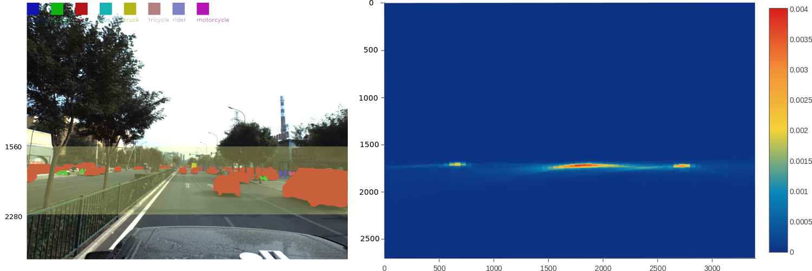

# CVPR 2018 WAD Video Segmentation Challenge Solution  

I was lucky to secure the 2nd palace in 2018 CVPR workshop on Autonomous Driving Kaggle Competition. The goal of this [Kaggle Challenge](https://www.kaggle.com/c/cvpr-2018-autonomous-driving), is to accurately segment objects such as car and pedestrian at instance-level from the video sequences recorded by the autonomous driving car. Our solution is based on Mask R-CNN. We use both [Apolloscape](http://apolloscape.auto), and [Cityscape](https://www.cityscapes-dataset.com),  datasets and only focus on a particular field of view in the image at the highest possible resolution. 

## Statistical Analysis
The image resolution of Apolloscape is 3384 by 2710. However, our interesting objects are not uniformly distributed over the image. Actually, as revealed in the 2D
histogram below, the distribution is densely concentrated in a narrow stripe of the whole field of view. For example, between y = 1560 to y = 2280, 99.7% of our interesting objects are localized in this region of interest (ROI). This is our key observation.

  
  
 Left, our perdiction result example. Right, 2D histogram of annotations. 

## Implemenation
The core algorithm in our solution is Mask R-CNN. There are a few open source implementations on the shelf. We use [Detectron](https://github.com/facebookresearch/detectron), the object detection library developed by the Mask R-CNN original authors Kaiming He, Piotr Dollar, Ross Girshick from Facebook AI Research team. As we learned from the previous [Kaggle image segmentation competition](https://www.kaggle.com/c/carvana-image-masking-challenge), to achieve better performance, higher image resolution for training and inference is always preferred. However, due to the GPU memory size constraint and our statistical analysis in the previous section, we crop and resize the image to 3384 by 720. With a Nvidia P100 graphical card, training a 9-class Mask R-CNN FPN model with ResNet X101 backbone network requires around 1560 MB GPU memory when the batch size is 1. However, to have a reliable solution, a full field of view prediction at
a lower resolution should be considered to recognize those objects that are not in our ROI coverage. In practice, we find it does not improve the performance.
Another interesting finding is the threshold for the object detection. Through experiment, 0.25 is the optimal threshold to obtain the highest leader board score. We use the pretrained model from COCO dataset provided by the [Detectron Model Zoo](https://github.com/facebookresearch/Detectron/blob/master/MODEL_ZOO.md).
More detailed information can be found from our project report. We also provide our [ model](https://www.dropbox.com/s/afwlpwfc9tw6nru/gold.pkl?dl=0) used for the competition.

## Usefull dataset links  
[www.nuscenes.org](www.nuscenes.org)   
[apolloscape.auto](apolloscape.auto)

